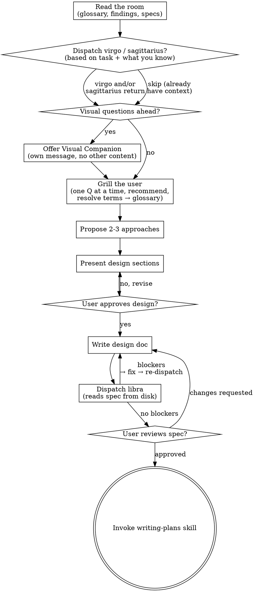

# Brainstorming Ideas Into Designs

Help turn ideas into fully formed designs and specs through natural collaborative dialogue.

Start by understanding the current project context, then ask questions one at a time to refine the idea. Once you understand what you're building, present the design and get user approval.

<HARD-GATE>
Do NOT invoke any implementation skill, write any code, scaffold any project, or take any implementation action until you have presented a design and the user has approved it. This applies to EVERY project regardless of perceived simplicity.
</HARD-GATE>

## Anti-Pattern: "This Is Too Simple To Need A Design"

Every project goes through this process. A todo list, a single-function utility, a config change — all of them. "Simple" projects are where unexamined assumptions cause the most wasted work. The design can be short (a few sentences for truly simple projects), but you MUST present it and get approval.

## Checklist

You MUST create a task for each of these items and complete them in order:

1. **Read the room** — read `docs/superpowers/glossary.md`, `findings-local.md`, `findings-external.md`, and any prior `specs/` if they exist. These reconstruct context from previous sessions. Skip files that don't exist yet.
2. **Explore (dispatch virgo / sagittarius)** — based on what the task needs and what you already know, decide: dispatch virgo for local codebase mapping, sagittarius for external research, both in parallel for cross-domain projects, or neither if you already have enough context. They write to `findings-local.md` / `findings-external.md` respectively.
3. **Offer visual companion** (if topic will involve visual questions) — this is its own message, not combined with a grill question. See the Visual Companion section below.
4. **Grill the user** — relentless interview to sharpen the idea, one question at a time, each with a recommended answer. Resolve terminology into `glossary.md` as it crystallizes. See the Grill section below.
5. **Propose 2-3 approaches** — with trade-offs and your recommendation
6. **Present design** — in sections scaled to their complexity, get user approval after each section
7. **Write design doc** — save to `docs/superpowers/specs/YYYY-MM-DD-<topic>-design.md` and commit
8. **Spec review (dispatch libra)** — independent review for blockers (placeholders, contradictions, ambiguity, scope creep)
9. **User reviews written spec** — ask user to review the spec file before proceeding
10. **Transition to implementation** — invoke writing-plans skill to create implementation plan

## Process Flow



**The terminal state is invoking writing-plans.** Do NOT invoke frontend-design, mcp-builder, or any other implementation skill. The ONLY skill you invoke after brainstorming is writing-plans.

## The Process

**Read the room first (mandatory):**

Before doing anything else, read these files if they exist (skip silently if not):
- `docs/superpowers/glossary.md` — the project's canonical terminology. Every term here is settled; do NOT re-ask what's already defined, and use these exact terms in all your output.
- `docs/superpowers/findings-local.md` — virgo's prior local codebase maps
- `docs/superpowers/findings-external.md` — sagittarius's prior external research
- Any `docs/superpowers/specs/*.md` for prior work on the same topic

A fresh session with these files restored has the context of every prior session that wrote to them. Don't waste the user's questions re-deriving what's already on disk.

**Assess scope before exploring or grilling:**

Before asking detailed questions, assess scope: if the request describes multiple independent subsystems (e.g., "build a platform with chat, file storage, billing, and analytics"), flag this immediately. Don't spend questions refining details of a project that needs to be decomposed first.

If the project is too large for a single spec, help the user decompose into sub-projects: what are the independent pieces, how do they relate, what order should they be built? Then brainstorm the first sub-project through the normal design flow. Each sub-project gets its own spec → plan → implementation cycle.

**Explore (dispatch virgo / sagittarius — your call):**

Based on what the task needs and what you already know, decide:
- **Local codebase unfamiliar or large** → dispatch **virgo** (writes `findings-local.md`)
- **External library / API / best practice needed** → dispatch **sagittarius** (writes `findings-external.md`)
- **Cross-domain large project** → dispatch **both in parallel** (they write separate files, no conflict)
- **You already have enough context** → skip exploration, go straight to grilling

Do NOT auto-dispatch both for every task. Virgo and sagittarius cost a round-trip each; only spend them when the gap is real.

```
Agent(subagent_type="virgo",
      description="Map <area> for <task>",
      prompt="<What map do you need? e.g. 'Trace the auth flow: where login is handled, how sessions are persisted, what middleware checks them. Anchor every claim to file:line. Write to docs/superpowers/findings-local.md.'>")

Agent(subagent_type="sagittarius",
      description="Research <library/topic>",
      prompt="<What do you need to know? e.g. 'How does library X handle Y? Cite primary sources, signal confidence. Append to docs/superpowers/findings-external.md.'>")
```

When both are dispatched, do it in a single message with two `Agent` calls so they run concurrently.

**Grill the user (replaces "ask clarifying questions"):**

Interview the user relentlessly about every aspect of the idea until you reach shared understanding. Walk down each branch of the decision tree, resolving dependencies between decisions one-by-one.

The grill rules:
- **One question at a time.** Multiple questions in one message is bewildering. Wait for the answer before asking the next.
- **Every question comes with a recommended answer.** Not "what do you want for X?" but "for X I'd recommend Y because Z — does that hold up?" An empty question is a missed recommendation.
- **Walk the decision tree, don't jump around.** Resolve one branch before moving to the next. Note dependencies between decisions explicitly.
- **If a question can be answered from disk, answer it from disk.** Read `findings-local.md`, `findings-external.md`, `glossary.md`, the codebase, prior specs. Only ask the user what only they know.
- **Resolve terminology into `glossary.md` as it crystallizes.** When a fuzzy term gets pinned down, write it to `docs/superpowers/glossary.md` right then — don't batch. Use the format below.
- **Challenge conflicts immediately.** If the user uses a term in a way that contradicts `glossary.md`, call it out: "Your glossary defines 'cancellation' as X, but you seem to mean Y — which is it?" Don't silently pick one.

Glossary entry format (canonical term + definition + `_Avoid_` aliases):
```markdown
**<Canonical Term>**:
<1-2 sentences: what it IS, not what it DOES>
_Avoid_: <synonym1>, <synonym2>
```

The glossary is **only terminology** — never implementation notes, scratch, or design decisions. Those go in the spec. If you can't decide whether something belongs in the glossary, ask: is this a *term unique to this project's domain*? If yes, glossary. If it's a general concept or an implementation choice, no.

End the grill when every load-bearing decision has a resolved answer (either from the user, from disk, or from glossary) and the design space is clear enough to propose approaches.

**Exploring approaches:**

- Propose 2-3 different approaches with trade-offs
- Present options conversationally with your recommendation and reasoning
- Lead with your recommended option and explain why

**Presenting the design:**

- Once you believe you understand what you're building, present the design
- Scale each section to its complexity: a few sentences if straightforward, up to 200-300 words if nuanced
- Ask after each section whether it looks right so far
- Cover: architecture, components, data flow, error handling, testing
- Be ready to go back and clarify if something doesn't make sense

**Design for isolation and clarity:**

- Break the system into smaller units that each have one clear purpose, communicate through well-defined interfaces, and can be understood and tested independently
- For each unit, you should be able to answer: what does it do, how do you use it, and what does it depend on?
- Can someone understand what a unit does without reading its internals? Can you change the internals without breaking consumers? If not, the boundaries need work.
- Smaller, well-bounded units are also easier for you to work with - you reason better about code you can hold in context at once, and your edits are more reliable when files are focused. When a file grows large, that's often a signal that it's doing too much.

**Working in existing codebases:**

- Explore the current structure before proposing changes. Follow existing patterns.
- Where existing code has problems that affect the work (e.g., a file that's grown too large, unclear boundaries, tangled responsibilities), include targeted improvements as part of the design - the way a good developer improves code they're working in.
- Don't propose unrelated refactoring. Stay focused on what serves the current goal.

## After the Design

**Documentation:**

- Write the validated design (spec) to `docs/superpowers/specs/YYYY-MM-DD-<topic>-design.md`
  - (User preferences for spec location override this default)
- **Use the spec-writer format** (problem-driven). Structure:
  ```
  # <Capability Name>
  Brief: one sentence describing what this is.

  ## Problem
  <!-- What is the current pain? What happens if not solved? -->
  <!-- If you can't write this section, stop — there's no justification for the spec. -->

  ## Design Rationale
  <!-- Why this design? What alternatives were considered? Must explain WHY, not just WHAT. -->

  ## Implementation Notes
  <!-- OPTIONAL. Design-phase fragments worth keeping. Not a full plan. -->

  ## Acceptance
  <!-- Verifiable checkpoints. How do we know this is done? -->
  ```
  Lead with the interface (signatures, schemas). Separate data structures from behavioral rules.
- Use elements-of-style:writing-clearly-and-concisely skill if available
- Commit the design document to git

**Spec Review (dispatch libra):**
You wrote this spec — you are not the best reviewer of it. Dispatch **libra** for an independent read. libra checks only for blocking gaps (placeholders, contradictions, ambiguity that would cause building the wrong thing, scope creep); its default is APPROVE.

```
Agent(subagent_type="libra",
      description="Review spec: <filename>",
      prompt="Review the spec at docs/superpowers/specs/<filename>.md. Flag only blockers — placeholders/TBDs, internal contradictions, requirements ambiguous enough to build the wrong thing, or scope covering multiple independent subsystems.")
```

libra writes its verdict to `docs/superpowers/reviews/<spec-name>-spec-review.md`. Read it.

**If libra finds blockers:** fix the spec, then re-dispatch libra (it re-reads from disk — fix the file, don't summarize).

**If libra approves:** proceed to the User Review Gate.

**User Review Gate:**
After the spec review loop passes, ask the user to review the written spec before proceeding:

> "Spec written and committed to `<path>`. Please review it and let me know if you want to make any changes before we start writing out the implementation plan."

Wait for the user's response. If they request changes, make them and re-dispatch libra to re-review the updated spec. Only proceed once the user approves.

**Implementation:**

- Invoke the writing-plans skill to create a detailed implementation plan
- Do NOT invoke any other skill. writing-plans is the next step.

## Key Principles

- **Read before asking.** If the answer is on disk (findings, glossary, specs, code), don't burn a user question on it.
- **Every grill question carries a recommendation.** "What do you want?" is a missed recommendation.
- **Resolve terminology inline.** When a term crystallizes, write it to `glossary.md` immediately.
- **YAGNI ruthlessly** - Remove unnecessary features from all designs
- **Explore alternatives** - Always propose 2-3 approaches before settling
- **Incremental validation** - Present design, get approval before moving on
- **Be flexible** - Go back and clarify when something doesn't make sense

## Visual Companion

A browser-based companion for showing mockups, diagrams, and visual options during brainstorming. Available as a tool — not a mode. Accepting the companion means it's available for questions that benefit from visual treatment; it does NOT mean every question goes through the browser.

**Offering the companion:** When you anticipate that upcoming questions will involve visual content (mockups, layouts, diagrams), offer it once for consent:
> "Some of what we're working on might be easier to explain if I can show it to you in a web browser. I can put together mockups, diagrams, comparisons, and other visuals as we go. This feature is still new and can be token-intensive. Want to try it? (Requires opening a local URL)"

**This offer MUST be its own message.** Do not combine it with clarifying questions, context summaries, or any other content. The message should contain ONLY the offer above and nothing else. Wait for the user's response before continuing. If they decline, proceed with text-only brainstorming.

**Per-question decision:** Even after the user accepts, decide FOR EACH QUESTION whether to use the browser or the terminal. The test: **would the user understand this better by seeing it than reading it?**

- **Use the browser** for content that IS visual — mockups, wireframes, layout comparisons, architecture diagrams, side-by-side visual designs
- **Use the terminal** for content that is text — requirements questions, conceptual choices, tradeoff lists, A/B/C/D text options, scope decisions

A question about a UI topic is not automatically a visual question. "What does personality mean in this context?" is a conceptual question — use the terminal. "Which wizard layout works better?" is a visual question — use the browser.

If they agree to the companion, read the detailed guide before proceeding:
`skills/brainstorming/visual-companion.md`
