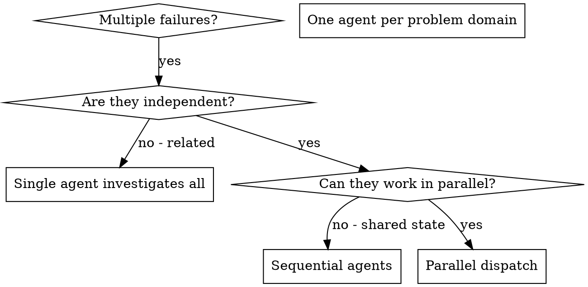

# Dispatching Parallel Agents

## Overview

You delegate tasks to specialized agents with isolated context. By precisely crafting their instructions and context, you ensure they stay focused and succeed at their task. They should never inherit your session's context or history — you construct exactly what they need. This also preserves your own context for coordination work.

When you have multiple unrelated failures (different test files, different subsystems, different bugs), investigating them sequentially wastes time. Each investigation is independent and can happen in parallel.

**Core principle:** Dispatch one agent per independent problem domain. Let them work concurrently.

**Why one-agent-per-domain, not one-agent-for-everything:** a single agent holding multiple independent problems has to context-switch between them, and each switch costs focus — it starts confusing the constraints of problem A with problem B, applying one fix's assumptions to another, and its context fills with the noise of all of them interleaved. Splitting by domain gives each agent one problem and the full context window to hold it, which is the condition under which an agent actually solves hard things. The parallelism is a bonus; the real win is that a focused agent is smarter than a scattered one. And your own context stays clean for integration, instead of being filled with every problem's investigation details.

## When to Use



**Use when:**
- 3+ test files failing with different root causes
- Multiple subsystems broken independently
- Each problem can be understood without context from others
- No shared state between investigations

**Don't use when:**
- Failures are related (fix one might fix others)
- Need to understand full system state
- Agents would interfere with each other

## The Pattern

### 1. Identify Independent Domains

Group failures by what's broken:
- File A tests: Tool approval flow
- File B tests: Batch completion behavior
- File C tests: Abort functionality

Each domain is independent - fixing tool approval doesn't affect abort tests.

### 2. Create Focused Agent Tasks

Each agent gets:
- **Specific scope:** One test file or subsystem
- **Clear goal:** Make these tests pass
- **Constraints:** Don't change other code
- **Expected output:** Summary of what you found and fixed

### 3. Dispatch in Parallel

```typescript
// In Claude Code / AI environment
Task("Fix agent-tool-abort.test.ts failures")
Task("Fix batch-completion-behavior.test.ts failures")
Task("Fix tool-approval-race-conditions.test.ts failures")
// All three run concurrently
```

### 4. Review and Integrate

When agents return:
- Read each summary
- Verify fixes don't conflict
- Run full test suite
- Integrate all changes

## Agent Prompt Structure

Good agent prompts are:
1. **Focused** - One clear problem domain
2. **Self-contained** - All context needed to understand the problem
3. **Specific about output** - What should the agent return?

```markdown
Fix the 3 failing tests in src/agents/agent-tool-abort.test.ts:

1. "should abort tool with partial output capture" - expects 'interrupted at' in message
2. "should handle mixed completed and aborted tools" - fast tool aborted instead of completed
3. "should properly track pendingToolCount" - expects 3 results but gets 0

These are timing/race condition issues. Your task:

1. Read the test file and understand what each test verifies
2. Identify root cause - timing issues or actual bugs?
3. Fix by:
   - Replacing arbitrary timeouts with event-based waiting
   - Fixing bugs in abort implementation if found
   - Adjusting test expectations if testing changed behavior

Do NOT just increase timeouts - find the real issue.

Return: Summary of what you found and what you fixed.
```

## Common Mistakes

| Mistake | Fix | Why |
|---------|-----|-----|
| **Too broad:** "Fix all the tests" — agent gets lost | **Specific:** "Fix agent-tool-abort.test.ts" — focused scope | A broad scope gives the agent permission to wander, and it will — touching files tangential to the real problem, "improving" things along the way, and burning its whole context budget without converging. Specific scope is a constraint that keeps its effort pointed at one thing, which is the only way it finishes. |
| **No context:** "Fix the race condition" — agent doesn't know where | **Context:** Paste the error messages and test names | The agent has no conversation history — it wasn't here when the bug appeared. "The race condition" means nothing to it without the failing test, the error output, and the reproduction. Under-specified context forces it to re-discover what you already know, which costs a round-trip and often re-discovers it wrong. |
| **No constraints:** Agent might refactor everything | **Constraints:** "Do NOT change production code" or "Fix tests only" | Without a constraint, the agent optimizes for the literal goal ("make tests pass") by any means, which includes weakening assertions, deleting failing tests, or rewriting production code to match the test. The constraint closes off the shortcuts that would "succeed" without actually fixing the bug. |
| **Vague output:** "Fix it" — you don't know what changed | **Specific:** "Return summary of root cause and changes" | After the agent returns, *you* have to integrate and trust the result. A vague return ("done") leaves you re-reading the entire diff to figure out what it did and why. A structured return (root cause + changes) lets you verify the fix is real without reconstructing the agent's reasoning from the code. |

## When NOT to Use

**Related failures:** Fixing one might fix others - investigate together first
**Need full context:** Understanding requires seeing entire system
**Exploratory debugging:** You don't know what's broken yet
**Shared state:** Agents would interfere (editing same files, using same resources)

## Dispatching Athena Guardians

The generic dispatch above uses anonymous `Task("...")` calls. In this fork, you have **9 single-purpose subagents** with isolated context, scoped tools, and built-in output formats. Use `subagent_type=` instead of writing prompts from scratch.

### What actually parallelizes (and what doesn't)

Parallel dispatch requires **both**:
1. **No time-ordering dependency** between the tasks (neither needs the other's output to start)
2. **No shared mutable state** (they don't edit the same files or write to the same output file)

Apply those two tests honestly. Most "let's parallelize this" combinations fail one of them.

#### Truly parallel — safe to dispatch concurrently

| Pattern | Dispatch | Why it's safe |
|---------|----------|---------------|
| N independent bugs in different subsystems | N × **cancer** | Each writes its own diagnosis file + edits its own scope. No shared state, no ordering. |
| N independent new-feature tasks from a plan | N × **capricorn** | Each implements one plan task. Safe **iff** the tasks touch disjoint files (the plan should already ensure this). |
| Map local code + research external library | **virgo** + **sagittarius** | Both read-only; deliver structured findings blocks (main agent writes `findings-local.md` and `findings-external.md`). No ordering. |
| Adversarial testing on N subsystems | N × **aries** | Each breaks its own subsystem; writes its own review file. |
| Polish N independent docs | N × **pisces** | Each edits its own doc. |

#### Looks parallel but isn't — dispatch sequentially

| Tempting combination | Why it's actually serial | Right order |
|----------------------|--------------------------|-------------|
| **capricorn** + **virgo** (build + map unfamiliar code) | capricorn needs virgo's map to know where to put things | virgo first → capricorn reads `findings-local.md` → capricorn |
| **cancer** + **sagittarius** (fix bug + research library behavior) | cancer's root-cause usually depends on what sagittarius finds | sagittarius first → cancer reads `findings-external.md` → cancer |
| **capricorn** + **sagittarius** (build feature + research its library) | same — implementation depends on library facts | sagittarius first → capricorn |
| **cancer** + **virgo** (fix bug + map unfamiliar code) | cancer needs the map to locate root cause | virgo first → cancer |

**The pattern:** "Explorer (virgo / sagittarius) + Actor (capricorn / cancer)" is almost always serial. The actor needs the explorer's findings to do its job. Don't dispatch them together hoping they'll synchronize — they won't, and the actor will guess wrong.

**The exception:** if the explorer's findings are **already on disk** from an earlier session (e.g. virgo mapped the codebase last week, findings-local.md exists), then the actor can read that and you don't need to dispatch the explorer at all in this turn. That's not parallel dispatch — that's reading the archive.

### Why the guardians beat anonymous Task

1. **No prompt engineering.** Each guardian already knows its role, tools, output format. You write the *task-specific* brief (what bug, what file, what scope), not the role definition.
2. **Tool permissions are scoped.** cancer has Edit but no Agent. virgo has Read/Grep/Glob but no Write. You can't accidentally give a reviewer the power to edit code.
3. **Output is structured.** cancer writes `diagnoses/<task>.md`; scorpio writes `reviews/<task>-spec.md`. The next session can restore context by reading these files — no chat transcripts to replay.
4. **Context is isolated.** Dispatching capricorn doesn't pollute your main context with implementation detail. Dispatching scorpio doesn't pollute it with review chatter. You stay focused on coordination.

### Scope isolation for parallel implementers

When dispatching multiple **capricorn** or multiple **cancer** in parallel, they will edit the same codebase. Prevent conflicts by scope-isolating in the brief:

```
Agent(subagent_type="cancer",
      description="Fix bug A in checkout flow",
      prompt="Bug: checkout hangs when cart has digital + physical items. Repro: [steps].
              Scope: ONLY touch src/checkout/. Do NOT touch src/billing/, src/inventory/.
              Write diagnosis to docs/superpowers/diagnoses/checkout-hang-diagnosis.md.")

Agent(subagent_type="cancer",
      description="Fix bug B in billing",
      prompt="Bug: invoice tax not calculated for EU customers. Repro: [steps].
              Scope: ONLY touch src/billing/. Do NOT touch src/checkout/, src/inventory/.
              Write diagnosis to docs/superpowers/diagnoses/eu-tax-diagnosis.md.")
```

The scope constraint is the difference between two clean fixes and a merge conflict.

### When NOT to use a guardian

- **Single-shot lookup** ("where is X defined?") → built-in Explore agent, not virgo
- **Quick fix you can do yourself in 30 seconds** → just do it; dispatching has overhead
- **Ambiguous task** ("fix the bug" with no repro) → ask the user for a repro first; cancer will BLOCKED otherwise
- **Task needs design judgment** → brainstorming skill first, not parallel dispatch
- **Explorer + Actor for the same goal** (e.g. virgo + capricorn to "map then build", sagittarius + cancer to "research then fix") → these are **sequential**, not parallel. The actor needs the explorer's output. Dispatch the explorer first, wait for its findings file, then dispatch the actor. Don't fake parallelism here — the actor will guess wrong without the explorer's conclusions.

## Real Example from Session

**Scenario:** 3 independent bugs reported after a major refactor. Each is in a different subsystem, with a clear reproduction.

**Bugs:**
- `src/checkout/`: cart total wrong when mixing tax-exempt and taxable items
- `src/billing/`: invoice PDF missing line items for $0 entries
- `src/inventory/`: stock count goes negative after concurrent returns

**Decision:** Three independent subsystems, three repros. No shared state. Dispatch **three cancer agents in parallel**, scope-isolated.

**Dispatch (single message, three Agent calls so they run concurrently):**
```
Agent(subagent_type="cancer",
      description="Fix cart-total bug in checkout",
      prompt="Bug: cart total is wrong when cart has both tax-exempt and taxable items.
              Repro: add 1 book ($10, taxable) + 1 gift card ($25, tax-exempt) → total shows $38.50 instead of $35.
              Scope: ONLY src/checkout/. Do NOT touch src/billing/ or src/inventory/.
              Diagnosis: docs/superpowers/diagnoses/cart-total-mixed-tax-diagnosis.md.")

Agent(subagent_type="cancer",
      description="Fix missing $0 line items in invoice PDF",
      prompt="Bug: invoice PDF omits line items priced at $0 (e.g. free promo items).
              Repro: order with 1 paid item ($15) + 1 free promo → PDF shows only the $15 line.
              Scope: ONLY src/billing/. Do NOT touch src/checkout/ or src/inventory/.
              Diagnosis: docs/superpowers/diagnoses/invoice-zero-line-items-diagnosis.md.")

Agent(subagent_type="cancer",
      description="Fix negative stock on concurrent returns",
      prompt="Bug: stock count for an item goes negative when two returns hit concurrently.
              Repro: stock=1; two concurrent returns of the same SKU → final stock=-1.
              Scope: ONLY src/inventory/. Do NOT touch src/checkout/ or src/billing/.
              Diagnosis: docs/superpowers/diagnoses/negative-stock-concurrent-returns-diagnosis.md.")
```

**Results (each cancer returns its own diagnosis + fix + regression test):**
- Cancer 1: Root cause — tax applied to whole cart instead of per-line. Fix: per-line tax in `src/checkout/total.ts`. Regression test added.
- Cancer 2: Root cause — PDF renderer skipped rows where `price === 0` (filter intended for null prices). Fix: distinguish `0` from `null` in `src/billing/pdf.ts`. Regression test added.
- Cancer 3: Root cause — `decrement` non-atomic; concurrent reads both saw stock=1 before either wrote. Fix: atomic compare-and-set in `src/inventory/stock.ts`. Regression test added.

**Integration:** All three fixes landed in separate files. No conflicts. Full suite green. Three diagnosis files written to `docs/superpowers/diagnoses/` — next session can read them if a related bug appears.

**Time saved:** 3 bugs diagnosed + fixed + regression-tested in the time of 1.

## Key Benefits

1. **Parallelization** - Multiple investigations happen simultaneously
2. **Focus** - Each agent has narrow scope, less context to track
3. **Independence** - Agents don't interfere with each other
4. **Speed** - 3 problems solved in time of 1

## Verification

After agents return:
1. **Review each summary** - Understand what changed
2. **Check for conflicts** - Did agents edit same code?
3. **Run full suite** - Verify all fixes work together
4. **Spot check** - Agents can make systematic errors

## Real-World Impact

From debugging session (2025-10-03):
- 6 failures across 3 files
- 3 agents dispatched in parallel
- All investigations completed concurrently
- All fixes integrated successfully
- Zero conflicts between agent changes
