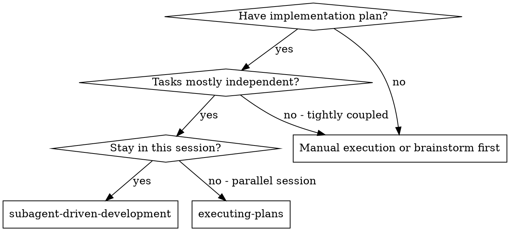
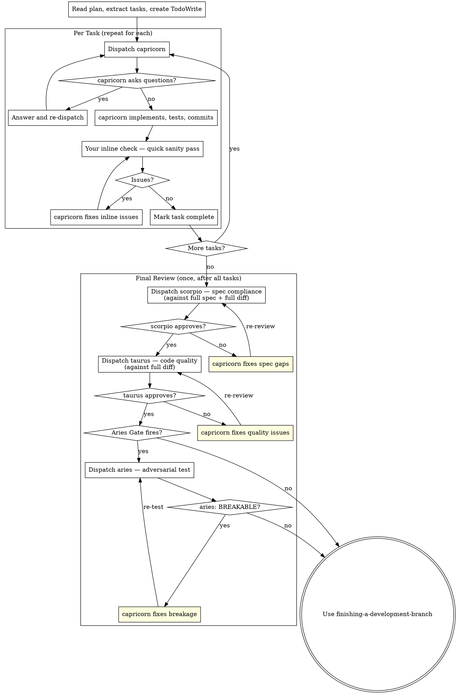

# Subagent-Driven Development

Execute plan by dispatching one **capricorn** subagent per task. You (the main agent) do a quick inline review after each task. After ALL tasks are done, dispatch **scorpio** then **taurus** once against the full diff — one spec-compliance review, one code-quality review, not one per task.

**Why this order matters:** per-task formal review (scorpio + taurus × N) costs 2 expensive subagent dispatches per task. They're both reviewers — they need scorpio=fable and taurus=sonnet just to do their job, which means ~3,300 tokens of agent definitions alone per task, plus the actual model inference. For 3 tasks that's ~10,000 tokens of overhead just on review agent context-load. And the reviews aren't even better — a spec-compliance issue that spans two tasks is invisible when you review each in isolation.

The better trade: you do the quick per-task check (you have context, you read the code, you know what changed), and formal review happens once against the aggregate. Scorpio sees the whole picture. Taurus critiques the whole codebase. Fewer dispatches, better reviews, less cost.

**Athena wiring:** The four roles below are filled by dedicated single-purpose agents (not general-purpose with inline prompts):
- **capricorn** — the implementer (executes one task, TDD, self-reviews, commits) — dispatched per task
- **scorpio** — the spec-compliance reviewer (verifies full implementation against spec) — dispatched ONCE after all tasks
- **taurus** — the code-quality reviewer (runs only AFTER scorpio passes) — dispatched ONCE after all tasks
- **aries** — the adversarial tester (dispatched ONCE after taurus, **only when the implementation touches a high-risk surface** — see Aries Gate below)

Each agent's discipline is baked into its own definition — you dispatch them bare, no prompt template needed.

**Why scorpio and taurus are separate agents despite reviewing only once:** they're not just reviewers — they're checks on *you*. After hours of coordinating capricorns, you have as much context invested as any implementer. Scorpio reads the code cold, from the spec, without knowing what you think it does. Taurus reads the diff without knowing which parts you're proud of and which you rushed. You can't replicate that — your inline per-task check is good enough to keep going, but the final review needs fresh eyes.

**Continuous execution:** Do not pause to check in with your human partner between tasks. Execute all tasks from the plan without stopping. The only reasons to stop are: BLOCKED status you cannot resolve, ambiguity that genuinely prevents progress, or all tasks complete. "Should I continue?" prompts and progress summaries waste their time — they asked you to execute the plan, so execute it.

**Why continuous, not check-in-per-task:** each "should I continue?" forces a human context-switch — they have to reload what the plan was, where you are, and what "continue" even means, to answer a question whose answer is almost always "yes, that's why I gave you a plan." The plan is the consent; approving it was the check-in. Stopping to re-confirm per task trades the user's attention (scarce, expensive to re-engage) for a safety that the plan + review gates already provide. Pause only when the plan turns out to be wrong, which is exactly the three stop conditions listed.

## When to Use



**vs. Executing Plans (parallel session):**
- Same session (no context switch)
- Fresh subagent per task (no context pollution)
- Two-stage review after each task: spec compliance first, then code quality
- Faster iteration (no human-in-loop between tasks)

## The Process



### Your inline per-task check

After capricorn finishes each task, you do a quick sanity pass before marking it complete. This is NOT a full review — it's a cheap spot-check:

- Did capricorn actually do what the task says? (read the commit diff)
- Are tests passing?
- Does the change look reasonable at a glance?

If something's off, tell capricorn what to fix and re-check. If it looks good, mark complete and move on. **Do not dispatch scorpio or taurus here.** That comes at the end.

**Why you and not a fresh subagent:** you've been reading capricorn's output between tasks. You know the plan. You have the full context. A quick sanity check costs you one `git diff` and 30 seconds. Dispatching scorpio per-task costs a fable round-trip and fresh context load — for a check you could do better and cheaper inline.

### Final review: one scorpio + one taurus for the whole batch

After ALL tasks are complete, dispatch scorpio once against the full spec and the full cumulative diff. This is better than per-task review — scorpio sees the whole picture and catches cross-task issues (Task 2 changed behavior Task 1 assumed, Task 3 added something Task 1 should have).

If scorpio approves, dispatch taurus once against the full diff.

### How to dispatch each agent

Dispatch bare — no prompt template. The agent's own definition carries the discipline. Pass only task-specific data:

**Per-task:**
- **capricorn**: `Agent(subagent_type="capricorn", description="Implement Task N: <name>", prompt="<full task text from plan>\n\n## Context\n<where it fits, dependencies>\n\n## Domain terms\n<canonical terms from docs/superpowers/glossary.md that this task touches — capricorn uses these verbatim in naming/commits and does NOT read the glossary itself; you are its only source of terminology>")`

**After all tasks:**
- **scorpio**: `Agent(subagent_type="scorpio", description="Spec compliance review: all tasks", prompt="Read the spec and plan from disk:\n- Spec: docs/superpowers/specs/<spec-name>.md\n- Plan: docs/superpowers/plans/<plan-name>.md\n\nGit range: BASE <sha> HEAD <sha>\n\nReview the full diff against the full spec. Flag any spec gap, missed requirement, or extra behavior — across all tasks.\n\nDo NOT ask the orchestrator to paste the spec or plan — read them yourself from the paths above.\n\nWrite your review to docs/superpowers/reviews/<batch>-spec.md.")`
- **taurus** (only if scorpio approves): `Agent(subagent_type="taurus", description="Code quality review: full implementation", prompt="BASE <sha> HEAD <sha>\n\nWrite your review to docs/superpowers/reviews/<batch>-quality.md.")` — taurus reads the diff itself
- **aries** (only if Aries Gate fires): `Agent(subagent_type="aries", description="Adversarial test: <what changed>", prompt="Target: <implementation summary, where it lives>.\nRisk surfaces I am worried about: <which of the 5 high-risk categories apply>.\nGit range: BASE <sha> HEAD <sha>.\n\nWrite your report to docs/superpowers/reviews/<batch>-adversarial.md.")`

### Aries Gate — when to dispatch aries

aries costs a sonnet round-trip per dispatch. Don't dispatch it for tasks that can't break in interesting ways. **Dispatch aries when the task touches ANY of these high-risk surfaces:**

| # | High-risk surface | Why it needs runtime attack |
|---|-------------------|-----------------------------|
| 1 | **Concurrency / threading / async shared state** | Race conditions, deadlocks, and torn writes only show when you actually run things concurrently. Static review sees none of it. |
| 2 | **External input** (user input, API requests, file parsing, network data, deserialization) | Untrusted data is where injection, overflow, and parser bugs live. taurus can suspect; aries confirms by feeding hostile payloads. |
| 3 | **State machine / lifecycle** (init/shutdown, session lifecycle, order-dependent calls) | "Call this before that" contracts fail in real call orders. aries calls things out of order and watches. |
| 4 | **Resource limits** (memory, disk, connections, file handles, timeouts) | Leaks and exhaustion only surface under pressure. aries applies the pressure. |
| 5 | **Skills / agents / MCP tools / hooks / bundled scripts** (anything that shapes agent behavior, gates tool calls, or ships executable code with a skill) | **Athena-specific.** Prompt injection, skill hijacking, MCP parameter poisoning, cross-agent context pollution, hook side-channels — AND shell footguns in every bundled `*.sh` / `*.cjs` / `*.js` / `*.py`: unguarded `rm -rf`, missing `set -e`, unquoted expansions, `eval`, `0.0.0.0` listeners, network-install-during-runtime. SKILL.md, agent.md, and bundled scripts are themselves an attack surface — they get injected at session start or run via Bash, so bugs here are recurring bugs across every future session. |

If the task touches none of these (pure calculation, refactoring a single function with no I/O, doc-only changes), **skip aries**. Mark the task complete after taurus passes.

If the task touches any of these, dispatch aries and tell it which surfaces you want attacked. aries writes its report to `docs/superpowers/reviews/<task>-adversarial.md`; you read the verdict (SOLID → proceed; BREAKABLE → capricorn fixes → re-dispatch aries).

**Note on surface 5:** for tasks that modify `skills/`, `.claude/agents/`, `hooks/`, or MCP server configs, aries is **mandatory, not optional** — these changes shape every future session, so a missed bug here is a recurring bug. Surface 5 always fires aries.

## Model Selection

Each agent comes with its own model tier baked in (capricorn=fable, scorpio=fable, taurus=sonnet, aries=sonnet). You do not pick models per dispatch.

The per-task check (your inline sanity pass) costs zero extra dispatches. This is the point: 3 tasks × (1 capricorn) + 1 scorpio + 1 taurus = 5 dispatches total, instead of 3 × (1 capricorn + 1 scorpio + 1 taurus) = 9.

**Task-size signals still matter** — they tell you whether to break a task down before handing it to capricorn:
- Touches 1-2 files with a complete spec → fine as one capricorn task
- Touches multiple files with integration concerns → consider splitting into multiple capricorn tasks
- Requires design judgment or broad codebase understanding → the task is under-specified; escalate back to writing-plans rather than dumping it on capricorn

## Handling capricorn's Status

capricorn reports one of four statuses. Handle each appropriately:

**DONE:** Proceed to spec compliance review.

**DONE_WITH_CONCERNS:** The implementer completed the work but flagged doubts. Read the concerns before proceeding. If the concerns are about correctness or scope, address them before review. If they're observations (e.g., "this file is getting large"), note them and proceed to review.

**NEEDS_CONTEXT:** The implementer needs information that wasn't provided. Provide the missing context and re-dispatch.

**BLOCKED:** The implementer cannot complete the task. Assess the blocker:
1. If it's a context problem, provide more context and re-dispatch with the same model
2. If the task requires more reasoning, re-dispatch with a more capable model
3. If the task is too large, break it into smaller pieces
4. If the plan itself is wrong, escalate to the human

**Never** ignore an escalation or force a retry without changes. If capricorn said it's stuck, something needs to change.

## Example Workflow

```
You: I'm using Subagent-Driven Development to execute this plan.

[Read plan file once: docs/superpowers/plans/feature-plan.md]
[Extract all 3 tasks with full text and context]
[Create TodoWrite with all tasks]

--- Task 1: Add install-hook command ---

[Dispatch capricorn with full task text + context]

capricorn: "Before I begin - should the hook be installed at user or system level?"

You: "User level (~/.config/superpowers/hooks/)"

capricorn: "Got it. Implementing now..."
[Later] capricorn:
  - Implemented install-hook command
  - Added tests, 5/5 passing
  - Self-review: Found I missed --force flag, added it
  - Committed

[Your inline check: git diff looks right, tests pass, mark complete]

--- Task 2: Recovery modes ---

[Dispatch capricorn with full task text + context]
capricorn: [No questions, proceeds, commits]

[Your inline check: looks reasonable. One issue — missing progress reporting.]
[capricorn fixes, re-checks, good. Mark complete.]

--- Task 3: Config validation ---

[Dispatch capricorn]
capricorn: [Implements, commits]
[Your inline check: clean. Mark complete.]

--- Final review ---

All 3 tasks done. Now the real review.

[Dispatch scorpio — spec compliance, full diff against full spec]
scorpio: ❌ Issues:
  - Task 2 implements recovery but spec says "report every 100 items" — Task 2 didn't do this
  - Task 3 validates server config but spec also requires client config validation
  - No extra/unwanted behavior detected

[capricorn fixes both]
[scorpio re-review]
scorpio: ✅ Full spec compliant

[Dispatch taurus — code quality, full diff]
taurus: Strengths: Good coverage, clean interfaces between modules.
        Issues (Important): PROGRESS_INTERVAL used as magic number in Task 2
        but not in Task 3's config polling — inconsistency.

[capricorn fixes]
[taurus re-review]
taurus: ✅ Approved

[Task touches nothing on Aries Gate surfaces — skip aries]

[Mark all tasks verified, dispatch finishing-a-development-branch]

Done!
```

## Advantages

**vs. Manual execution:**
- Subagents follow TDD naturally
- Fresh context per task (no confusion)
- Parallel-safe (subagents don't interfere)
- Subagent can ask questions (before AND during work)

**vs. Executing Plans:**
- Same session (no handoff)
- Continuous progress (no waiting)
- Review checkpoints automatic

**Efficiency gains:**
- No file reading overhead (controller provides full text)
- Controller curates exactly what context is needed
- Subagent gets complete information upfront
- Questions surfaced before work begins (not after)

**Quality gates:**
- Your inline per-task check catches obvious issues immediately (free — you're already in context)
- One spec-compliance review (scorpio, fable) against the full cumulative diff — catches cross-task issues invisible to per-task review
- One code-quality review (taurus, sonnet) against the full diff, only after spec passes
- One adversarial test (aries, sonnet) only if the Aries Gate fires

**Cost (per batch, 3 tasks):**
- 3 capricorn dispatches (fable) + 1 scorpio (fable) + 1 taurus (sonnet) = 5 dispatches
- Old model: 3 capricorn + 3 scorpio + 3 taurus = 9 dispatches
- ~40% fewer review dispatches, zero quality loss (aggregate review is strictly better than per-task)

## Red Flags

**Never:**
- Start implementation on main/master branch without explicit user consent
- **Skip the final scorpio + taurus review** — your inline check is NOT a substitute; it's a sanity pass to keep momentum. Formal review still happens at the end.
- **Do scorpio/taurus per-task** — wasted tokens, worse review (cross-task issues invisible). Once at the end is cheaper AND better.
- Proceed with unfixed issues
- Dispatch multiple implementation subagents in parallel (conflicts) — *why: two implementers editing the same working tree race on files; whoever writes last wins silently, and the other's changes vanish or corrupt. The isolation is the point of subagents, but it only holds one editor at a time per tree.*
- Make subagent read plan file (provide full text instead) — *why: a Read of the plan pulls the whole plan into the subagent's context, including every other task it isn't doing, diluting focus and letting it "helpfully" implement adjacent work. Passing only its task's text scopes its world to exactly its job.*
- Skip scene-setting context (subagent needs to understand where task fits)
- Ignore subagent questions (answer before letting them proceed)
- Accept "close enough" on spec compliance (spec reviewer found issues = not done)
- Skip review loops (reviewer found issues = implementer fixes = review again)
- Let capricorn's self-review replace your inline check (do both — yours is the sanity gate, capricorn's is the discipline)
- **Start code quality review before spec compliance is ✅** (wrong order) — *why: taurus reviewing code that doesn't meet spec wastes a review — the code might be well-written but implementing the wrong thing, and quality feedback on wrong behavior is throwaway work. Confirm the code does the right thing (scorpio) before judging whether it does it well (taurus).*
- **Skip aries when the Aries Gate fires** — high-risk surface tasks must be adversarially tested
- **Auto-dispatch aries for low-risk tasks** — don't waste a sonnet round-trip on pure refactor or doc-only changes; only fire when the gate says so
- **Skip aries on changes to `skills/`, `.claude/agents/`, `hooks/`, or MCP configs** — surface 5 is mandatory, these shape every future session

**If subagent asks questions:**
- Answer clearly and completely
- Provide additional context if needed
- Don't rush them into implementation

**If reviewer finds issues:**
- Implementer (same subagent) fixes them
- Reviewer reviews again
- Repeat until approved
- Don't skip the re-review

**If subagent fails task:**
- Dispatch fix subagent with specific instructions
- Don't try to fix manually (context pollution)

## Integration

**Required workflow skills:**
- **superpowers:using-git-worktrees** - Ensures isolated workspace (creates one or verifies existing)
- **superpowers:writing-plans** - Creates the plan this skill executes
- **superpowers:requesting-code-review** - Dispatches taurus for code review (standalone use, outside the per-task loop)
- **superpowers:finishing-a-development-branch** - Complete development after all tasks

**Subagents should use:**
- **superpowers:test-driven-development** - Subagents follow TDD for each task

**Alternative workflow:**
- **superpowers:executing-plans** - Use for parallel session instead of same-session execution
