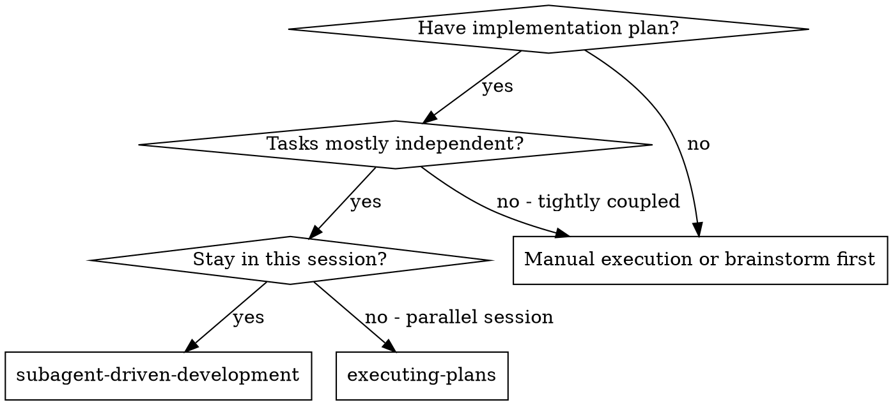
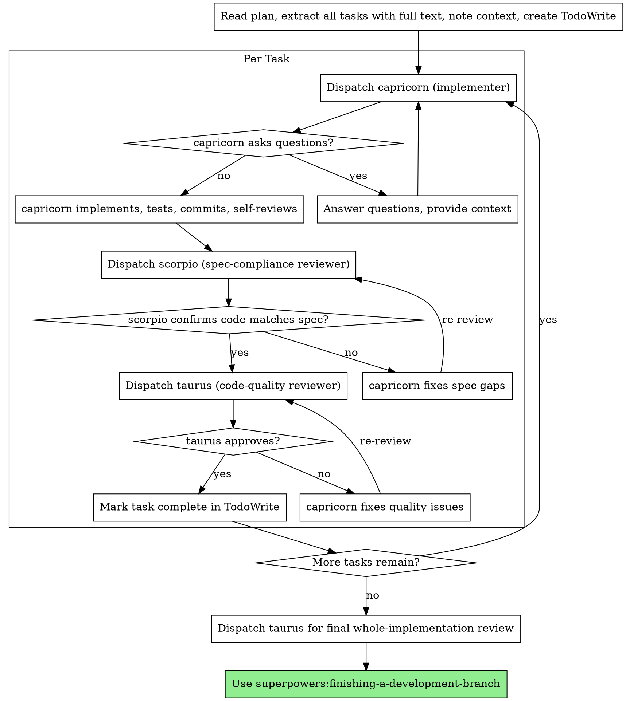

# Subagent-Driven Development

Execute plan by dispatching fresh subagent per task, with two-stage review after each: spec compliance review first, then code quality review.

**Why subagents:** You delegate tasks to specialized agents with isolated context. By precisely crafting their instructions and context, you ensure they stay focused and succeed at their task. They should never inherit your session's context or history — you construct exactly what they need. This also preserves your own context for coordination work.

**Core principle:** Fresh subagent per task + two-stage review (spec then quality) = high quality, fast iteration

**Athena wiring:** The three roles below are filled by dedicated single-purpose agents (not general-purpose with inline prompts):
- **capricorn** — the implementer (executes one task, TDD, self-reviews, commits)
- **scorpio** — the spec-compliance reviewer (verifies code matches spec, does NOT trust the implementer's report)
- **taurus** — the code-quality reviewer (runs only AFTER scorpio passes)

Each agent's discipline is baked into its own definition — you dispatch them bare, no prompt template needed.

**Continuous execution:** Do not pause to check in with your human partner between tasks. Execute all tasks from the plan without stopping. The only reasons to stop are: BLOCKED status you cannot resolve, ambiguity that genuinely prevents progress, or all tasks complete. "Should I continue?" prompts and progress summaries waste their time — they asked you to execute the plan, so execute it.

## When to Use



**vs. Executing Plans (parallel session):**
- Same session (no context switch)
- Fresh subagent per task (no context pollution)
- Two-stage review after each task: spec compliance first, then code quality
- Faster iteration (no human-in-loop between tasks)

## The Process



### How to dispatch each agent

Dispatch bare — no prompt template. The agent's own definition carries the discipline. Pass only task-specific data:

- **capricorn**: `Agent(subagent_type="capricorn", description="Implement Task N: <name>", prompt="<full task text from plan>\n\n## Context\n<where it fits, dependencies>")`
- **scorpio**: `Agent(subagent_type="scorpio", description="Spec review Task N", prompt="Spec:\n<full task text>\n\nImplementer claims:\n<capricorn's report>\n\nGit range: BASE <sha> HEAD <sha>")`
- **taurus**: `Agent(subagent_type="taurus", description="Code quality review Task N", prompt="BASE <sha> HEAD <sha>")` — taurus reads the diff itself

## Model Selection

The three agents come with their own model tier baked in (capricorn=fable, scorpio=fable, taurus=sonnet). You do not pick models per dispatch.

**Task-size signals still matter** — they tell you whether to break a task down before handing it to capricorn:
- Touches 1-2 files with a complete spec → fine as one capricorn task
- Touches multiple files with integration concerns → consider splitting into multiple capricorn tasks
- Requires design judgment or broad codebase understanding → the task is under-specified; escalate back to writing-plans rather than dumping it on capricorn

## Handling capricorn's Status

capricorn reports one of four statuses. Handle each appropriately:

**DONE:** Proceed to spec compliance review.

**DONE_WITH_CONCERNS:** The implementer completed the work but flagged doubts. Read the concerns before proceeding. If the concerns are about correctness or scope, address them before review. If they're observations (e.g., "this file is getting large"), note them and proceed to review.

**NEEDS_CONTEXT:** The implementer needs information that wasn't provided. Provide the missing context and re-dispatch.

**BLOCKED:** The implementer cannot complete the task. Assess the blocker:
1. If it's a context problem, provide more context and re-dispatch with the same model
2. If the task requires more reasoning, re-dispatch with a more capable model
3. If the task is too large, break it into smaller pieces
4. If the plan itself is wrong, escalate to the human

**Never** ignore an escalation or force a retry without changes. If capricorn said it's stuck, something needs to change.

## Example Workflow

```
You: I'm using Subagent-Driven Development to execute this plan.

[Read plan file once: docs/superpowers/plans/feature-plan.md]
[Extract all 5 tasks with full text and context]
[Create TodoWrite with all tasks]

Task 1: Hook installation script

[Get Task 1 text and context (already extracted)]
[Dispatch capricorn with full task text + context]

capricorn: "Before I begin - should the hook be installed at user or system level?"

You: "User level (~/.config/superpowers/hooks/)"

capricorn: "Got it. Implementing now..."
[Later] capricorn:
  - Implemented install-hook command
  - Added tests, 5/5 passing
  - Self-review: Found I missed --force flag, added it
  - Committed

[Dispatch scorpio (spec-compliance reviewer)]
scorpio: ✅ Spec compliant - all requirements met, nothing extra

[Get git SHAs, dispatch taurus (code-quality reviewer)]
taurus: Strengths: Good test coverage, clean. Issues: None. Approved.

[Mark Task 1 complete]

Task 2: Recovery modes

[Get Task 2 text and context (already extracted)]
[Dispatch capricorn with full task text + context]

capricorn: [No questions, proceeds]
capricorn:
  - Added verify/repair modes
  - 8/8 tests passing
  - Self-review: All good
  - Committed

[Dispatch scorpio]
scorpio: ❌ Issues:
  - Missing: Progress reporting (spec says "report every 100 items")
  - Extra: Added --json flag (not requested)

[capricorn fixes issues]
capricorn: Removed --json flag, added progress reporting

[scorpio reviews again]
scorpio: ✅ Spec compliant now

[Dispatch taurus]
taurus: Strengths: Solid. Issues (Important): Magic number (100)

[capricorn fixes]
capricorn: Extracted PROGRESS_INTERVAL constant

[taurus reviews again]
taurus: ✅ Approved

[Mark Task 2 complete]

...

[After all tasks]
[Dispatch taurus for final whole-implementation review]
taurus: All requirements met, ready to merge

Done!
```

## Advantages

**vs. Manual execution:**
- Subagents follow TDD naturally
- Fresh context per task (no confusion)
- Parallel-safe (subagents don't interfere)
- Subagent can ask questions (before AND during work)

**vs. Executing Plans:**
- Same session (no handoff)
- Continuous progress (no waiting)
- Review checkpoints automatic

**Efficiency gains:**
- No file reading overhead (controller provides full text)
- Controller curates exactly what context is needed
- Subagent gets complete information upfront
- Questions surfaced before work begins (not after)

**Quality gates:**
- Self-review catches issues before handoff
- Two-stage review: spec compliance, then code quality
- Review loops ensure fixes actually work
- Spec compliance prevents over/under-building
- Code quality ensures implementation is well-built

**Cost:**
- More subagent invocations (implementer + 2 reviewers per task)
- Controller does more prep work (extracting all tasks upfront)
- Review loops add iterations
- But catches issues early (cheaper than debugging later)

## Red Flags

**Never:**
- Start implementation on main/master branch without explicit user consent
- Skip reviews (spec compliance OR code quality)
- Proceed with unfixed issues
- Dispatch multiple implementation subagents in parallel (conflicts)
- Make subagent read plan file (provide full text instead)
- Skip scene-setting context (subagent needs to understand where task fits)
- Ignore subagent questions (answer before letting them proceed)
- Accept "close enough" on spec compliance (spec reviewer found issues = not done)
- Skip review loops (reviewer found issues = implementer fixes = review again)
- Let implementer self-review replace actual review (both are needed)
- **Start code quality review before spec compliance is ✅** (wrong order)
- Move to next task while either review has open issues

**If subagent asks questions:**
- Answer clearly and completely
- Provide additional context if needed
- Don't rush them into implementation

**If reviewer finds issues:**
- Implementer (same subagent) fixes them
- Reviewer reviews again
- Repeat until approved
- Don't skip the re-review

**If subagent fails task:**
- Dispatch fix subagent with specific instructions
- Don't try to fix manually (context pollution)

## Integration

**Required workflow skills:**
- **superpowers:using-git-worktrees** - Ensures isolated workspace (creates one or verifies existing)
- **superpowers:writing-plans** - Creates the plan this skill executes
- **superpowers:requesting-code-review** - Dispatches taurus for code review (standalone use, outside the per-task loop)
- **superpowers:finishing-a-development-branch** - Complete development after all tasks

**Subagents should use:**
- **superpowers:test-driven-development** - Subagents follow TDD for each task

**Alternative workflow:**
- **superpowers:executing-plans** - Use for parallel session instead of same-session execution
