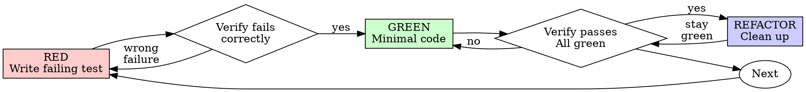

# Test-Driven Development (TDD)

## Overview

Write the test first. Watch it fail. Write minimal code to pass.

**Core principle:** If you didn't watch the test fail, you don't know if it tests the right thing.

**Why:** A test that passes can pass for the wrong reason — because the assertion is weak, because it's testing a mock instead of real code, because the feature already existed, or because the test never actually reached the code path it claims to. The only way to know a test is *connected to the behavior* is to see it fail, and fail for the *right* reason (feature missing), before the code exists. Watching it fail is the proof that the test is wired to something real. Skip that, and every subsequent "pass" is a claim with no evidence behind it.

**Violating the letter of the rules is violating the spirit of the rules.**

## When to Use

**Always:**
- New features
- Bug fixes
- Refactoring
- Behavior changes

**Exceptions (ask your human partner):**
- Throwaway prototypes
- Generated code
- Configuration files

Thinking "skip TDD just this once"? Stop. That's rationalization.

## The Iron Law

```
NO PRODUCTION CODE WITHOUT A FAILING TEST FIRST
```

Write code before the test? Delete it. Start over.

**Why "delete" is the rule, not "salvage":** the moment you wrote code before the test, you designed the code from an internal model of the solution — not from the spec the test would have forced you to write first. Keeping that code "as reference" means your tests will be shaped to fit code you already wrote, which is tests-after in disguise: you'll test what you built instead of what should be built. The code looks done, so it biases every test you write next toward confirming it rather than specifying it. Deleting it is the only way to make the tests honest. The hours are gone either way; the question is whether the next hours produce code you can trust or code that *looks* right.

**No exceptions:**
- Don't keep it as "reference"
- Don't "adapt" it while writing tests
- Don't look at it
- Delete means delete

Implement fresh from tests. Period.

## Red-Green-Refactor



### RED - Write Failing Test

Write one minimal test showing what should happen.

<Good>
```typescript
test('retries failed operations 3 times', async () => {
  let attempts = 0;
  const operation = () => {
    attempts++;
    if (attempts < 3) throw new Error('fail');
    return 'success';
  };

  const result = await retryOperation(operation);

  expect(result).toBe('success');
  expect(attempts).toBe(3);
});
```
Clear name, tests real behavior, one thing
</Good>

<Bad>
```typescript
test('retry works', async () => {
  const mock = jest.fn()
    .mockRejectedValueOnce(new Error())
    .mockRejectedValueOnce(new Error())
    .mockResolvedValueOnce('success');
  await retryOperation(mock);
  expect(mock).toHaveBeenCalledTimes(3);
});
```
Vague name, tests mock not code
</Bad>

**Requirements:**
- One behavior
- Clear name
- Real code (no mocks unless unavoidable)

### Verify RED - Watch It Fail

**MANDATORY. Never skip.**

```bash
npm test path/to/test.test.ts
```

Confirm:
- Test fails (not errors)
- Failure message is expected
- Fails because feature missing (not typos)

**Test passes?** You're testing existing behavior. Fix test.

**Test errors?** Fix error, re-run until it fails correctly.

**Why "test passes immediately = fix the test":** a test that passes before you've written the feature is, by definition, not testing the feature. Either the behavior already exists (your test adds nothing), the test isn't reaching the code you think it is, or the assertion is so weak it can't distinguish present from absent. A green test at RED is a broken instrument — it will report "pass" no matter what you do, which means it can never catch a regression. The discipline is: if it didn't fail, it isn't testing, and you don't have a test yet.

### GREEN - Minimal Code

Write simplest code to pass the test.

<Good>
```typescript
async function retryOperation<T>(fn: () => Promise<T>): Promise<T> {
  for (let i = 0; i < 3; i++) {
    try {
      return await fn();
    } catch (e) {
      if (i === 2) throw e;
    }
  }
  throw new Error('unreachable');
}
```
Just enough to pass
</Good>

<Bad>
```typescript
async function retryOperation<T>(
  fn: () => Promise<T>,
  options?: {
    maxRetries?: number;
    backoff?: 'linear' | 'exponential';
    onRetry?: (attempt: number) => void;
  }
): Promise<T> {
  // YAGNI
}
```
Over-engineered
</Bad>

Don't add features, refactor other code, or "improve" beyond the test.

### Verify GREEN - Watch It Pass

**MANDATORY.**

```bash
npm test path/to/test.test.ts
```

Confirm:
- Test passes
- Other tests still pass
- Output pristine (no errors, warnings)

**Test fails?** Fix code, not test.

**Other tests fail?** Fix now.

### REFACTOR - Clean Up

After green only:
- Remove duplication
- Improve names
- Extract helpers

Keep tests green. Don't add behavior.

### Repeat

Next failing test for next feature.

## Good Tests

| Quality | Good | Bad |
|---------|------|-----|
| **Minimal** | One thing. "and" in name? Split it. | `test('validates email and domain and whitespace')` |
| **Clear** | Name describes behavior | `test('test1')` |
| **Shows intent** | Demonstrates desired API | Obscures what code should do |

## Why Order Matters

**"I'll write tests after to verify it works"**

Tests written after code pass immediately. Passing immediately proves nothing:
- Might test wrong thing
- Might test implementation, not behavior
- Might miss edge cases you forgot
- You never saw it catch the bug

Test-first forces you to see the test fail, proving it actually tests something.

**"I already manually tested all the edge cases"**

Manual testing is ad-hoc. You think you tested everything but:
- No record of what you tested
- Can't re-run when code changes
- Easy to forget cases under pressure
- "It worked when I tried it" ≠ comprehensive

Automated tests are systematic. They run the same way every time.

**"Deleting X hours of work is wasteful"**

Sunk cost fallacy. The time is already gone. Your choice now:
- Delete and rewrite with TDD (X more hours, high confidence)
- Keep it and add tests after (30 min, low confidence, likely bugs)

The "waste" is keeping code you can't trust. Working code without real tests is technical debt.

**"TDD is dogmatic, being pragmatic means adapting"**

TDD IS pragmatic:
- Finds bugs before commit (faster than debugging after)
- Prevents regressions (tests catch breaks immediately)
- Documents behavior (tests show how to use code)
- Enables refactoring (change freely, tests catch breaks)

"Pragmatic" shortcuts = debugging in production = slower.

**"Tests after achieve the same goals - it's spirit not ritual"**

No. Tests-after answer "What does this do?" Tests-first answer "What should this do?"

Tests-after are biased by your implementation. You test what you built, not what's required. You verify remembered edge cases, not discovered ones.

Tests-first force edge case discovery before implementing. Tests-after verify you remembered everything (you didn't).

30 minutes of tests after ≠ TDD. You get coverage, lose proof tests work.

## Common Rationalizations

| Excuse | Reality | Why |
|--------|---------|-----|
| "Too simple to test" | Simple code breaks. Test takes 30 seconds. | "Simple" describes your *understanding*, not the code's failure surface. Simple code breaks at exactly the boundaries you didn't think worth testing — null, empty, off-by-one, concurrent calls. The 30 seconds costs less than the one time the simple thing was wrong and you shipped it. |
| "I'll test after" | Tests passing immediately prove nothing. | A test written after the code is shaped by the code. It will pass, because you wrote it to pass — which means it confirms your implementation rather than specifying the requirement. You get coverage without confidence: the test can't fail because it was never independent of the code. |
| "Tests after achieve same goals" | Tests-after = "what does this do?" Tests-first = "what should this do?" | Tests-after document the implementation as-is, including its bugs — they encode "this is how it behaves" rather than "this is how it should behave." When the requirement changes, tests-after fight you, because they were never about the requirement. Tests-first are a spec the code must meet; tests-after are a transcript of the code's current opinions. |
| "Already manually tested" | Ad-hoc ≠ systematic. No record, can't re-run. | Manual testing runs the cases you remembered, in the order you thought of them, once. The next change to the code invalidates all of it, and you'll have to redo the whole manual pass — except this time you'll skip the boring cases because you "already know they work." Automated tests run every case, every time, for free, forever. Manual is a single-use check; automated is a permanent guard. |
| "Deleting X hours is wasteful" | Sunk cost fallacy. Keeping unverified code is technical debt. | The hours are spent regardless. The choice is only about the next hours: spend them producing code you can trust (delete, re-do with tests), or producing code that looks right (keep, bolt on tests after). The first feels wasteful and isn't; the second feels efficient and produces bugs you'll debug at 2am. |
| "Keep as reference, write tests first" | You'll adapt it. That's testing after. Delete means delete. | "Reference" code is a magnet — once it's in front of you, your tests will converge on it rather than on the spec. You can't help it; the existing shape anchors what you write. The only way to write tests that specify rather than confirm is to remove the thing they'd confirm. |
| "Need to explore first" | Fine. Throw away exploration, start with TDD. | Exploration is legitimate — you need to learn the shape of the problem. But exploration code is code written without a spec, which is exactly the code you can't trust. Keep the *learning* (notes, design), throw away the *code*, then write the real version test-first. Exploration informs the spec; it doesn't get to be the implementation. |
| "Test hard = design unclear" | Listen to test. Hard to test = hard to use. | A test is the first consumer of your code, written under ideal conditions (you control everything). If it's hard to test, every real caller has the same friction — but without your patience. Test difficulty is the design complaining about itself; the pain is information about the interface, not an obstacle to route around with mocks. |
| "TDD will slow me down" | TDD faster than debugging. Pragmatic = test-first. | "Slower to write" is true per-line; "slower to ship" is false. TDD front-loads the debugging you'd otherwise do after, when it's more expensive (the code is "done," context is cold, the bug is buried under a feature's worth of changes). The speed comparison isn't TDD vs. no-TDD, it's TDD vs. TDD-plus-late-debugging. |
| "Manual test faster" | Manual doesn't prove edge cases. You'll re-test every change. | Manual is fast for one check and impossibly slow across a project's lifetime, because every future change requires re-running every manual check — which nobody does. So either you re-test nothing (regressions ship) or you re-test everything (you become a manual CI that's slower than automated CI and skips the boring cases). |
| "Existing code has no tests" | You're improving it. Add tests for existing code. | Untested legacy is a liability, not an excuse. The same logic that says "test new code" says "characterize existing code you're about to touch" — because if you change untested code and break it, nothing will tell you. Adding tests before modifying legacy is how you make the change safe; the absence of prior tests is the reason, not a waiver. |

## Red Flags - STOP and Start Over

- Code before test
- Test after implementation
- Test passes immediately
- Can't explain why test failed
- Tests added "later"
- Rationalizing "just this once"
- "I already manually tested it"
- "Tests after achieve the same purpose"
- "It's about spirit not ritual"
- "Keep as reference" or "adapt existing code"
- "Already spent X hours, deleting is wasteful"
- "TDD is dogmatic, I'm being pragmatic"
- "This is different because..."

**All of these mean: Delete code. Start over with TDD.**

## Example: Bug Fix

**Bug:** Empty email accepted

**RED**
```typescript
test('rejects empty email', async () => {
  const result = await submitForm({ email: '' });
  expect(result.error).toBe('Email required');
});
```

**Verify RED**
```bash
$ npm test
FAIL: expected 'Email required', got undefined
```

**GREEN**
```typescript
function submitForm(data: FormData) {
  if (!data.email?.trim()) {
    return { error: 'Email required' };
  }
  // ...
}
```

**Verify GREEN**
```bash
$ npm test
PASS
```

**REFACTOR**
Extract validation for multiple fields if needed.

## Verification Checklist

Before marking work complete:

- [ ] Every new function/method has a test
- [ ] Watched each test fail before implementing
- [ ] Each test failed for expected reason (feature missing, not typo)
- [ ] Wrote minimal code to pass each test
- [ ] All tests pass
- [ ] Output pristine (no errors, warnings)
- [ ] Tests use real code (mocks only if unavoidable)
- [ ] Edge cases and errors covered

Can't check all boxes? You skipped TDD. Start over.

## When Stuck

| Problem | Solution |
|---------|----------|
| Don't know how to test | Write wished-for API. Write assertion first. Ask your human partner. |
| Test too complicated | Design too complicated. Simplify interface. |
| Must mock everything | Code too coupled. Use dependency injection. |
| Test setup huge | Extract helpers. Still complex? Simplify design. |

## Debugging Integration

Bug found? Write failing test reproducing it. Follow TDD cycle. Test proves fix and prevents regression.

Never fix bugs without a test.

## Testing Anti-Patterns

When adding mocks or test utilities, read @testing-anti-patterns.md to avoid common pitfalls:
- Testing mock behavior instead of real behavior
- Adding test-only methods to production classes
- Mocking without understanding dependencies

## Final Rule

```
Production code → test exists and failed first
Otherwise → not TDD
```

No exceptions without your human partner's permission.
