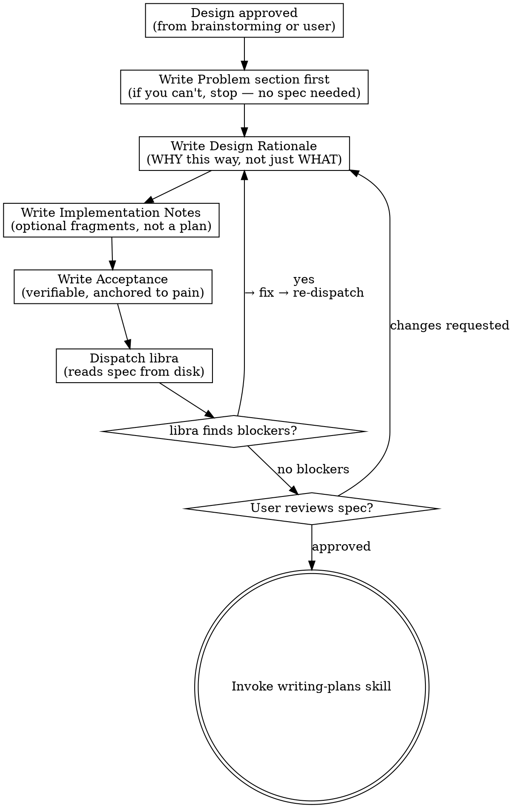

# Writing Specs

Turn an approved design into a problem-driven spec document, independently reviewed and user-approved, then hand off to planning.

## Pain-Point-Driven Development

Every line of code you write costs something: it must be written, tested, reviewed, debugged, maintained, migrated, and eventually deleted. The only justification for paying that cost is that the code solves a real pain point — something that is currently broken, missing, or painful enough that someone feels it.

This is not a platitude. It is the organizing principle of the spec format below, and it has teeth:

- **If you cannot name a specific pain point, you do not need a spec.** There is no problem to solve, and no code to write. Stop.
- **Every section in the spec exists to serve one question: does this design actually address the pain point?** A design that doesn't address the pain point is useless, no matter how elegant. A design that addresses the pain point but also solves three unrelated future problems is scope creep, no matter how tempting.
- **Design rationale is not decoration.** It is the argument that this design, among all alternatives, best addresses the pain point. If you can't write this argument, you haven't finished designing — you've only described.

**Why this matters:** specs written without a pain point are the most expensive kind of document. They look complete — sections filled, format followed, review passed — but the code they produce solves a problem nobody has. The team builds it anyway (the spec said so), ships it, and discovers the pain point was imaginary. Now you have code in production that nobody needs, and every future change must work around it. A spec without a pain point doesn't just waste the time spent writing it; it creates permanent carrying costs. The Problem section is the spec's immune system — if you can't write it honestly, the spec rejects itself.

## The Spec Format: Why Each Section Exists

The format is not a template to fill in. It is a chain of reasoning, each section answering one question the next section depends on:

```
Problem        →  Why are we here? What hurts?
Design Rationale →  Why does THIS design fix it, among all alternatives?
Implementation Notes →  What fragments from the design phase should survive into planning?
Acceptance     →  How do we know the pain is gone?
```

**Why this order:** you can't judge a design without knowing what problem it's solving. You can't write implementation notes without a settled design. You can't define acceptance criteria without knowing what success looks like against the original pain. Each section is gated on the one before it — skip one and the rest are unmoored.

### Problem

```
## Problem

<!-- What is the current pain? Who feels it? When does it hurt? -->
<!-- What happens if we do nothing? (This is the real alternative — not "build something else," but "live with it.") -->
<!-- If you cannot write a concrete, honest answer to the above, stop. There is no justification for this spec. -->
```

This is the most important section. It is the only reason the spec exists. Write it as if a skeptical colleague is reading it asking "do we actually need to do anything here?" — because that's exactly who should be reading it.

**Anti-patterns:**
- "The system needs X" — not a pain point, just a desire
- "It would be nice to have" — not a pain point
- "Best practice says we should" — not a pain point, cargo-culting
- "We might need it someday" — not a pain point, speculation

A real pain point is specific: who hurts, when, how often, how badly. "Developers can't deploy on Fridays because the release process takes 4 hours" is a pain point. "We should improve the deployment pipeline" is not.

**Why this gate exists:** the Problem section is where bad specs die. If you can't write it, the spec should not exist — and that's a good thing. Better to kill a spec here than to discover it was pointless six months after the code ships.

### Design Rationale

```
## Design Rationale

<!-- Why this design? What alternatives were considered and rejected? -->
<!-- For each alternative: what made it worse at addressing the pain point? -->
<!-- Must explain WHY, not just WHAT. -->
```

This is the core of the spec. It answers: among all the ways we could solve this problem, why this way?

**What belongs here:**
- The design and why it was chosen
- Alternatives considered, and the specific reasons each was rejected (always anchored to the pain point — "Alternative A doesn't address X aspect of the pain" not "Alternative A is less clean")
- Trade-offs made, and why they fall the way they do

**What does NOT belong here:**
- Neutral description of the design ("The system has three components...") — that's documentation, not rationale
- Architecture diagrams without explanation — a picture of the design is not the reason for it

**Why this is the core:** future maintainers — including you, six months from now — will read this spec and wonder "why did they do it this way?" The code tells them WHAT. Only the rationale tells them WHY. Without rationale, every design decision looks arbitrary, and the next person to touch it will either cargo-cult the original (preserving decisions that no longer apply) or rewrite it (breaking decisions that still do). The rationale is the difference between a spec that ages well and one that becomes liability.

### Implementation Notes

```
## Implementation Notes

<!-- OPTIONAL. Design-phase fragments worth keeping. -->
<!-- Not a full plan. Real planning happens in writing-plans. -->
```

Sticky notes from the design conversation. A data shape that crystallized during grilling. A constraint that came up when comparing alternatives. A file that will need special attention. Things you don't want to lose between the design conversation and the implementation plan.

**What belongs here:** fragments that emerged during design that aren't obvious from the design rationale alone.
**What does NOT belong here:** pseudocode, architecture-as-code, "Step 1: create the database." That's writing-plans' job.

**Why this is optional:** not every design produces fragments worth recording. Forcing this section when there's nothing to say produces filler. Let it be empty.

### Acceptance

```
## Acceptance

<!-- Verifiable checkpoints. Yes/no completion criteria. -->
<!-- Each item must answer: how do we know the pain is gone? -->
```

Judged against the Problem section: did we actually solve the pain we set out to solve?

**Good acceptance criteria:**
- "A developer can deploy to production in under 10 minutes (down from 4 hours)" — quantifiable, anchored to the pain
- "The checkout flow completes in under 3 steps (down from 7)" — measurable before/after

**Bad acceptance criteria:**
- "The system works correctly" — unverifiable
- "All tests pass" — circular (tests should encode acceptance, not replace it)
- "The team is happy" — unmeasurable

**Why this anchors the spec:** acceptance criteria are the contract. They say "when these are true, the pain is resolved and the work is done." Without them, "done" means whatever the implementer decides it means — which is usually "the code compiles."

## When to Use

- After brainstorming, when the design has user approval (the normal flow)
- Standalone: when the user says "write a spec for X" and the idea is already clear enough to formalize
- NOT during brainstorming — the design isn't settled yet, and writing a spec before the pain point is fully understood produces a document that looks authoritative but is built on guesswork

## Process Flow



<HARD-GATE>
Do NOT invoke writing-plans or any implementation skill until:
1. The Problem section is written and honest (a real pain point, not a rationalization)
2. The Design Rationale explains WHY this design, not just WHAT it is
3. libra has reviewed and approved
4. The user has reviewed and approved

A spec that survives this gate has earned the right to become a plan. One that hasn't is a draft — treat it as such.
</HARD-GATE>

**Why the gate exists:** the spec is the last place where changing your mind is cheap. Every decision locked into the spec becomes concrete in the plan, and every plan step becomes code. A spec that skips independent review ships assumptions the author didn't know they made; a spec that skips user approval ships decisions the user never signed off on; a spec with a weak Problem section ships a solution to a problem nobody has. All three failures surface during implementation, when rework costs are highest. The gate forces the cheapest checks first.

**The terminal state is invoking writing-plans.** Do NOT invoke any implementation skill. The ONLY skill you invoke after writing-spec is writing-plans.

## Spec Review (dispatch libra)

You wrote this spec — you are not the best reviewer of it. Dispatch **libra** for an independent read. libra checks for blocking gaps; its default is APPROVE.

```
Agent(subagent_type="libra",
      description="Review spec: <filename>",
      prompt="Review the spec at docs/superpowers/specs/<filename>.md. Flag only blockers: (1) Problem section is vague, missing, or describes a non-problem (no real pain point), (2) Design Rationale describes WHAT without explaining WHY this design over alternatives, (3) placeholders/TBDs, (4) internal contradictions, (5) requirements ambiguous enough to build the wrong thing, (6) scope covering multiple independent subsystems.")
```

libra writes its verdict to `docs/superpowers/reviews/<spec-name>-spec-review.md`. Read it.

**If libra finds blockers:** fix the spec, then re-dispatch libra (it re-reads from disk — fix the file, don't summarize the changes).

**If libra approves:** proceed to the User Review Gate.

## User Review Gate

After the spec review loop passes, ask the user to review the written spec:

> "Spec written and saved to `<path>`. Please review it — especially the Problem section. If the pain point doesn't feel right, everything below it needs to change. Let me know if you want any adjustments before we start writing the implementation plan."

Wait for the user's response. If they request changes, make them and re-dispatch libra to re-review the updated spec. Only proceed once the user approves.

## Handoff

Invoke the **writing-plans** skill to create the implementation plan. Do NOT invoke any other skill.

## Key Principles

- **Pain-point-driven.** No pain point → no spec → no code. The Problem section is the spec's reason to exist.
- **Design rationale over design description.** WHY, not WHAT. A spec without rationale is a recipe without reasoning.
- **Every section gates the next.** Problem → Rationale → Notes → Acceptance is a chain of reasoning, not a fill-in-the-blanks form.
- **Independent review is mandatory.** libra catches what you can't see in your own writing.
- **User signs off before planning.** The spec is the contract; both sides read it before work begins.
- **Implementation notes are optional fragments, not a plan.** Don't let them grow into pseudocode. That's writing-plans' job.
